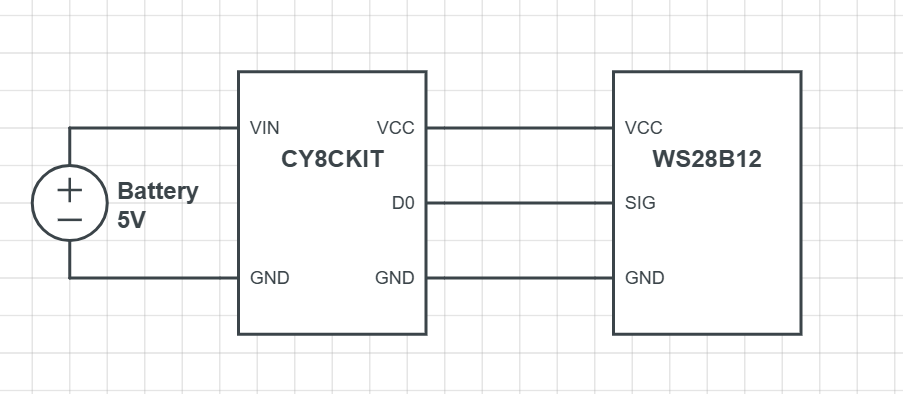

# BGT60 Parking-Sensor
The BGT60 Parking Sensor is a stationary parking sensor designed to detect the distance of a car from a fixed point. This project uses an Infineon BGT60TR13C radar sensor and an Adafruit NeoPixel strip to provide a visual indication of the distance.

# Features
- Detects distance of a car from a fixed point using radar technology
- Provides visual indication of distance using an Adafruit NeoPixel strip
- Configurable distance settings for safe and danger zones

# Requirements
- Infineon CY8CKIT-062S2-AI board
  - includes BGT60TR13C radar sensor
- Adafruit NeoPixel strip (18 LEDs)
- Arduino IDE

# Configuration
- Distance settings:
    - Minimum distance: 10cm
    - Maximum distance: 100cm
    - Safe distance: 40cm
    - Danger distance: 15cm
- Radar sensor settings:
    - Start frequency: 58 MHz
    - Bandwidth: 4.5 MHz
    - ADC divider: 60
    - Chirp length: 128 samples

# Usage
1. Connect the BGT60TR13C radar sensor to the Infineon CY8CKIT-062S2-AI board according to the pinout.
2. Connect the Adafruit NeoPixel strip to the board.
3. Upload the provided code to the board using the Arduino IDE.
4. The sensor will start detecting the distance and providing a visual indication using the NeoPixel strip.

